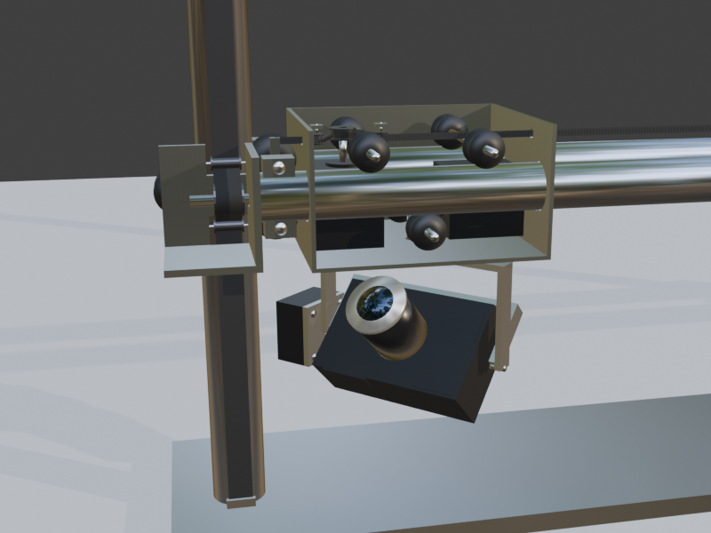
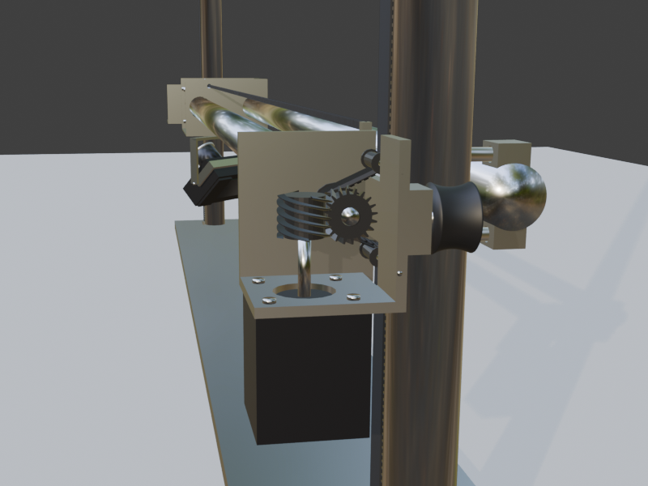

# Planar gantry

A simplified planar stage modeled in Blender. A carriage rides two horizontal beams, those beams ride two vertical rails, and an inverted Canon EOS M100 pans and tilts on the carriage. One Blender unit is one inch. The origin is the floor center: X is width, Y is depth with the front negative, and Z is up.

The fixed frame is 48 × 6 × 72. Carriage travel is X −17.77 to 17.11 and beam height 8.39 to 69.78. Pan and tilt each travel ±45°. Dimensions, clearances, and the motion loop are in [docs/specification.md](docs/specification.md).





## Layout

| Path | Contents |
| --- | --- |
| `scripts/build_gantry.py` | Builds the scene, checks clearances, and saves the blend |
| `planar_stage.blend` | Saved scene at frame 0 |
| `docs/specification.md` | As-built dimensions |
| `docs/window_gantry_1.png` | Close-up of the carriage, camera, and left end bracket |
| `docs/window_gantry_2.png` | Right end bracket, lift motor, and outer wheel |

## Rebuild

The script targets Blender 5.1 and writes `planar_stage.blend`. Run it from Blender’s Python, for example:

```
blender --background --python scripts/build_gantry.py
```

It clears the open scene, builds the machine, samples the travel box for overlaps, and saves the blend at the home pose (bottom-left, pan and tilt at −45°). The console report ends with `pair_hits` and `motor_snags`. Both should be 0.

Playback is one loop, `Loop_Box`, frames 0–1046 at 24 fps. Vertical travel is 3.8 in/s, set by the 5:1 lift and the 15 mm, 3 mm-pitch belts. Horizontal travel is 15.7 in/s. The carriage visits bottom-left, top-left, top-right, and bottom-right. At each corner it holds position and sweeps pan and tilt through the ±45° square. Frame 1046 matches frame 0.
